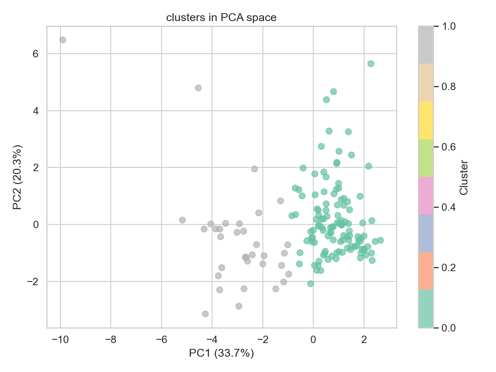
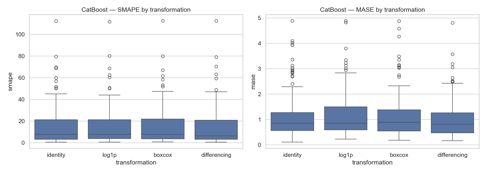
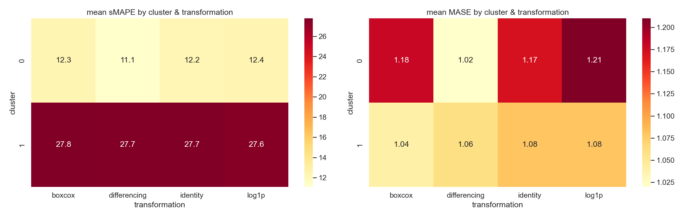
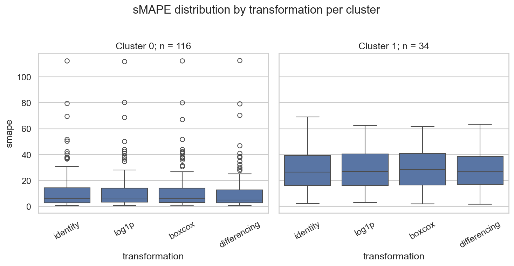

# Отчет по проекту

## Постановка задачи

**Гипотеза:** различные трансформации таргета по разному влияют на качество прогнозирования глобальной модели в зависимости от типа временного ряда

**Цель:** определить какая из 4 трансформаций будет самой полезной для модели catboost и зависит ли ответ от характеристик ряда

Рассматриваемые трансформации:

1. **Identity**
2. **log1p** - логарифмическое преобразование
3. **Box-Cox** — преобразование Бокса-Кокса с единым labmda для всех рядов
4. **Differencing** — первые разности

## Описание данных

Был взят датасет M4 monthly из forecastingdata.org. Случайным образом было отобрано 150 рядов, период сезонности - 12, горизонт прогнозирования - 18 шагов

Последние 18 наблюдений каждого ряда - тест, остальное - обучение

## Методология эксперимента

### Кластеризация рядов

Для ответа на вопрос "какая трансформация полезнее для каких типов рядов" необходимо разделить ряды на группы по их характеристикам

Из каждого ряда извлечены статистические признаки:

| признак              |                                                  |
|----------------------|--------------------------------------------------|
| mean, std, cv        | уровень, вариабельность, коэф вариации           |
| trend_strength       | сила тренда                                      |
| seasonality_strength | сила сезонности                                  |
| acf1, acf_seasonal   | автокорреляция на лаге 1 и на сезонном лаге (12) |
| diff_acf1            | автокореляция первых разностей                   |
| skewness, kurtosis   | асиметрия и эксцесс                              |
| length               | длина ряда                                       |

После стандартизации признаков применен **KMeans**. Оптимальное число кластеров выбрано по silhouette score: **k = 2**.

**Профили кластеров:**

| кластер | N   | trend | seasonality | acf1 | length |                                  |
|---------|-----|-------|-------------|------|--------|----------------------------------|
| 0       | 116 | 0.93  | 0.32        | 0.94 | 236    | длиные ряды с сильным трендом    |
| 1       | 34  | 0.40  | 0.20        | 0.45 | 108    | короткие ряды и слабая структура |

### Бейзлайны

- **Naive** — последнее известное значение
- **SeasonalNaive** — значение из того же сезона прошлого года
- **AutoTheta** — автоматический метод theta
- **AutoETS** — автоматический ETS

бейзлайны были обучены на исходных данных без трансформации

### Глобальная модель catboost

Для каждой из четырех трансформаций была обучена одна глобальная модель catboost на всех 150 рядах одновременно. Признаки:

- Лаги: 1–12, 18, 24
- Скользящие статистики: mean и std по окнам 3, 6, 12
- Позиция в сезонном цикле: t mod 12

Прогнозирование — рекурсивная стратегия (предсказание на шаг вперед с подстановкой прогноза в историю)

### Метрики

- **sMAPE** — симметричная процентная ошибка, шкала 0–200, не зависит от масштаба ряда
- **MASE** - ошибка, нормированная на сезонный наивный прогноз. MASE < 1 — модель лучше SeasonalNaive, MASE > 1 — хуже

## Результаты

### Общее сравнение

| Модель        | Трансформация | sMAPE     | MASE     |
|---------------|---------------|-----------|----------|
| AutoTheta     | identity      | **14.15** | 0.94     |
| AutoETS       | identity      | 14.62     | **0.91** |
| CatBoost      | differencing  | 14.86     | 1.03     |
| CatBoost      | identity      | 15.72     | 1.15     |
| CatBoost      | boxcox        | 15.80     | 1.15     |
| CatBoost      | log1p         | 15.82     | 1.18     |
| Naive         | identity      | 17.06     | 1.18     |
| SeasonalNaive | identity      | 17.55     | 1.19     |

катбуст с differencing трансформацией показывает лучший результат среди всех катбустов и приближается к статистическим бейзлайнам autoTheta/AutoETS

\newpage

### Результаты по кластерам

Средний smape:

| кластер | boxcox | differencing | identity | log1p     |
|---------|--------|--------------|----------|-----------|
| 0       | 12.28  | **11.09**    | 12.20    | 12.38     |
| 1       | 27.78  | 27.70        | 27.72    | **27.55** |

Средний mase:

| кластер | boxcox   | differencing | identity | log1p |
|---------|----------|--------------|----------|-------|
| 0       | 1.18     | **1.02**     | 1.17     | 1.21  |
| 1       | **1.04** | 1.06         | 1.08     | 1.08  |

\newpage

\newpage

## Выводы

- трансформация differencing показала себя лучше всех. Для глобального catboost первые разности дают sMAPE 14.86, что на 0.9 лучше чем без трансформации. differencing убирает нестационарность и модели легче учить паттерны.

- польза от трансформации зависит от типа ряда. Для кластера 0 differencing дает заметный выигрыш, в отличие от кластера 1 (там разница между трансформациями минимальная)

- log1p и box-cox не дают улучшения по сравнению с identity. M4 monthly ряды в основном имеют умеренную дисперсию, так что стабилизация ее через log/box-cox не дает особого профита

- статистические бейзлайны хороши (AuthoTheta и AutoETS) и превосходят глобальный катбуст с лучшей трансформацией
